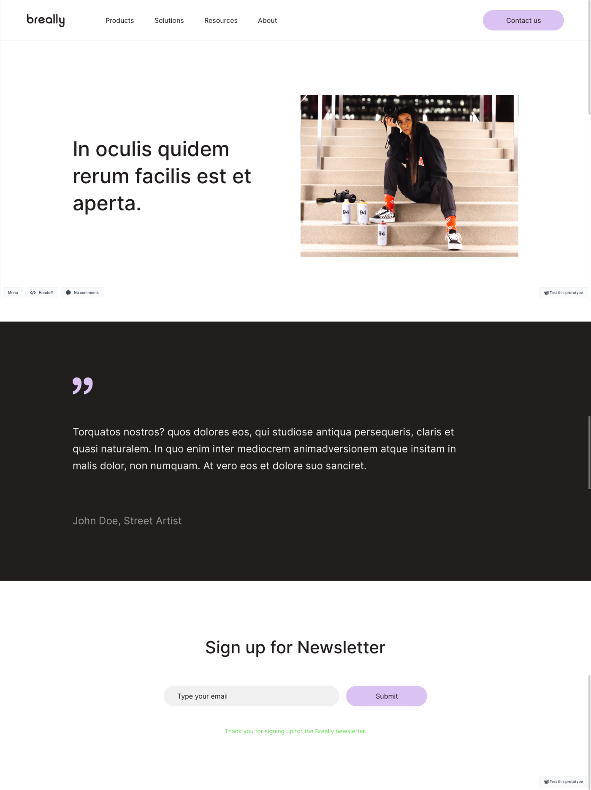

# Recruitment task for company X

## Task content

The goal of this task is to build a website in headless approach. The data should be fetched from CMS via API. The website should be built using React or Next.js.

### Tips ☝️

1. Only the homepage should be built as a part of the task
2. Links in the header should be generated based on API data (there night be differences compared to the design)
3. Texts and images in individual sections should be generated based on API data (there might be differences compared to the design)

## How to run the app

In the project directory, you can run:

### `npm run dev`

I have also deployed the app to vercel, you can check it here:

### [https://recruitment-task-generated-pages.vercel.app/](https://recruitment-task-generated-pages.vercel.app/)

### env variables

This project needs env variables to work. Please check `.env.example` and add it.

## Some explanations about code architecture, libraries etc. Why I decided to do some things like I did:

1. App is created in `next.js`, because business wanted a headless approach. I used approach similar to gatsby, all content is generated on build time. EX. after changes in api, new build needs to be triggered. It is also possible to change it to SSR.
2. For styling I have used scss modules, because it is really fast combination with programs that autogenerate css like `marvelapp` used to show this design.
3. There is only one form, so I have decided to not use any forms library, in real life could use and that would improve user experience, but would also needs more time for development.
4. I've written styles that are partially responsive. Should be ok on desktop and on some tablets. Would be easily possible to change it for full responsive, but that would need to use more of my time.
5. I decided to fully type API, in real life would be better if API could generate types and could just import it here. As I mentioned in newsletter file, API shouldn't ask for authorization for this action, so I have decided to add 2 additional public variables, for demonstration purpose only.
